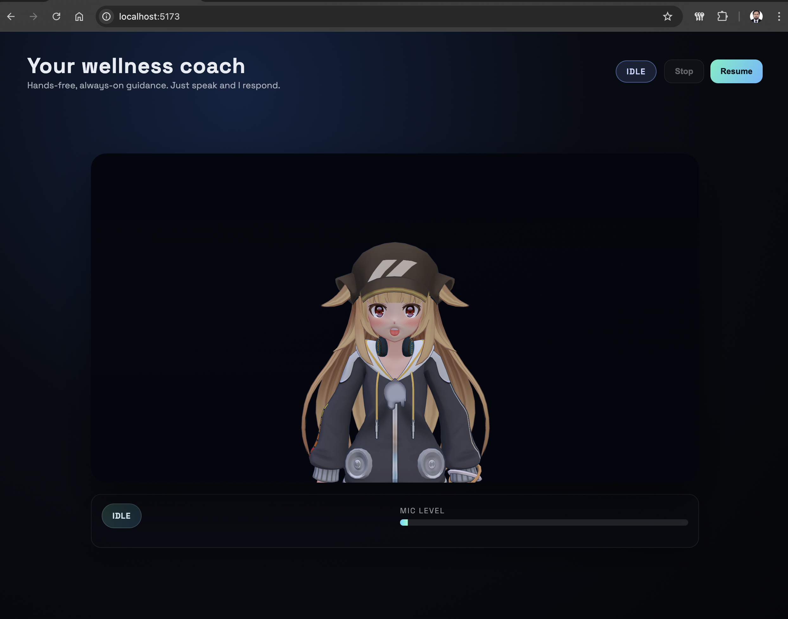
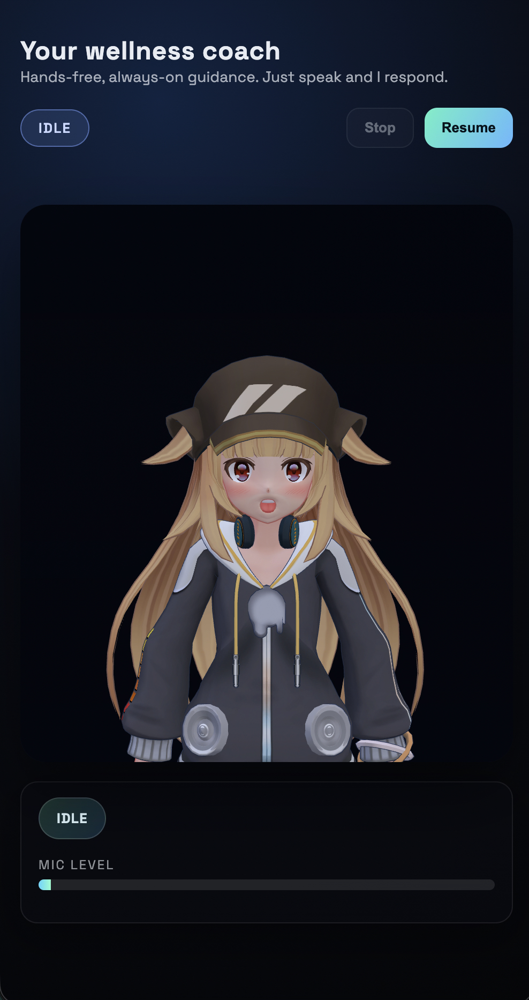

# Wellness Coach Avatar - POC Documentation

## Document Index

This repository contains all professional documentation for the **Always-On Urdu-Speaking Wellness Coach Avatar** Proof of Concept (POC).

## Preview

### Desktop



### Mobile

<p align="center">
  
</p>

---

### Architecture Documentation

| Document | Path | Description |
|----------|------|-------------|
| High-Level Design & Architecture | [architecture/high-level-design.md](architecture/high-level-design.md) | System design, component responsibilities, and architectural decisions |
| Architecture Diagram Description | [architecture/architecture-diagram.md](architecture/architecture-diagram.md) | Logical architecture, data flow, control flow, and real-time pipeline |
| Tools, Technologies & Services | [architecture/tools-and-technologies.md](architecture/tools-and-technologies.md) | Complete inventory of tools, SDKs, APIs, and services with POC vs. production suitability |

### Product Documentation

| Document | Path | Description |
|----------|------|-------------|
| Business Requirements Document (BRD) | [product/brd.md](product/brd.md) | Business goals, target users, problem statement, success criteria |
| Product Requirements Document (PRD) | [product/prd.md](product/prd.md) | User personas, journeys, functional and non-functional requirements |
| POC Scope & Minimum Features | [product/poc-scope.md](product/poc-scope.md) | Prioritized feature list, must-haves vs. future scope |

### Technical Documentation

| Document | Path | Description |
|----------|------|-------------|
| Technical Design Document (TDD) | [technical/tdd.md](technical/tdd.md) | Component-level overview, API responsibilities, data flow, error handling |
| Integration & End-to-End Flow | [technical/integration-flow.md](technical/integration-flow.md) | Step-by-step walkthrough of the complete user interaction pipeline |

---

### Folder Structure

```
docs/
├── README.md                              # This file - document index
├── architecture/
│   ├── high-level-design.md               # System design & architecture
│   ├── architecture-diagram.md            # Architecture diagram description
│   └── tools-and-technologies.md          # Tools, technologies & services
├── product/
│   ├── brd.md                             # Business Requirements Document
│   ├── prd.md                             # Product Requirements Document
│   └── poc-scope.md                       # POC scope & minimum features
└── technical/
    ├── tdd.md                             # Technical Design Document
    └── integration-flow.md                # Integration & end-to-end flow
```

---

### Audience

- **Non-technical stakeholders**: Start with [product/brd.md](product/brd.md) and [product/poc-scope.md](product/poc-scope.md)
- **Product managers**: Read [product/prd.md](product/prd.md) and [architecture/high-level-design.md](architecture/high-level-design.md)
- **Engineers**: Focus on [technical/tdd.md](technical/tdd.md), [technical/integration-flow.md](technical/integration-flow.md), and [architecture/](architecture/) docs

---

## Setup & Run (POC)

### Prerequisites

- **Node.js** 18 or higher (includes npm)
- **OpenAI API key** with access to the Realtime API
- **Modern browser** -- Chrome 90+ or Edge 90+ (WebRTC and WebGL required)
- **Microphone** -- built-in or external

### Step-by-Step Instructions

**1. Clone the repository**

```bash
git clone https://github.com/mfaizanshaikh/wellness-coach.git
cd wellness-coach
```

**2. Install dependencies**

```bash
npm install
```

**3. Configure environment variables**

Copy the example file and add your OpenAI API key:

```bash
cp .env.example .env
```

Open `.env` and replace the placeholder with your actual key:

```
OPENAI_API_KEY=sk-your-actual-api-key-here
```

The remaining variables have sensible defaults and are optional:

| Variable | Default | Description |
|----------|---------|-------------|
| `OPENAI_API_KEY` | *(required)* | Your OpenAI API key |
| `OPENAI_REALTIME_MODEL` | `gpt-realtime` | Realtime conversation model |
| `OPENAI_REALTIME_VOICE` | `marin` | AI voice for text-to-speech |
| `OPENAI_REALTIME_INSTRUCTIONS` | Urdu wellness coach prompt | Overrides the built-in system prompt if set |
| `FRONTEND_ORIGIN` | `http://localhost:5173` | CORS allowed origin |
| `PORT` | `3001` | Backend server port |

**4. Place your avatar model**

Ensure a VRM file exists at `public/avatar.vrm`. The repository includes a default avatar. To use your own, replace this file with any VRM-format 3D model.

**5. Start the backend server**

```bash
npm run server
```

You should see:

```
Realtime token server listening on :3001
```

**6. Start the frontend dev server** (in a second terminal)

```bash
npm run dev
```

You should see:

```
VITE v5.x.x  ready in xxx ms

➜  Local:   http://localhost:5173/
```

**7. Open the app**

Navigate to **http://localhost:5173** in Chrome or Edge.

**8. Activate the session**

- You will see the 3D avatar in a dark environment with a card that says **"Tap to let me listen"**
- **Click or tap anywhere** on the overlay -- this unlocks the browser's audio context and microphone (a one-time browser requirement)
- Your browser will ask for **microphone permission** -- grant it
- The status badge in the top-right will change: **Idle** → **Connecting** → **Live**

**9. Start talking**

- Once the status shows **Live**, the avatar will greet you in Urdu automatically
- **Just speak** -- no buttons needed. The mic level meter at the bottom confirms your voice is being captured
- The avatar will respond in Urdu with lip-synced speech, facial expressions, and gestures
- To end the session, click **Stop**. To restart, click **Resume**.

### Troubleshooting

| Problem | Solution |
|---------|----------|
| Status stuck on "Connecting" | Check that the backend is running on port 3001 and your API key is valid |
| "Failed to fetch client secret" | Verify `OPENAI_API_KEY` in `.env` has Realtime API access |
| No audio from avatar | Make sure you clicked the tap-to-prime overlay; check browser isn't muting the tab |
| Avatar not visible | Confirm `public/avatar.vrm` exists and is a valid VRM file |
| Microphone not working | Check browser permissions -- click the lock icon in the address bar to verify mic access |
| Repeated "Error" status | Network issue or OpenAI API outage; the system auto-retries every 3 seconds |

### Document Version

| Field | Value |
|-------|-------|
| Version | 1.0 |
| Date | February 2026 |
| Status | POC Complete |
| Author | Engineering Team |
